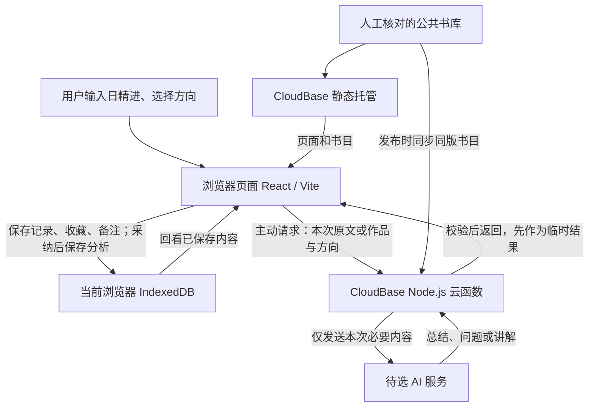

# 文学与内心冲突｜技术设计（TECH_DESIGN）

日期：2026-09-20  
任务归属：Day 5｜第 1 周  
依据：PRD.md（Day 4 已提交版本 3fddff6）。本文是默认建议稿，供用户核对；方案尚未部署，接口与数据模型尚未实现。

## 0. 已知条件、待回答问题与临时假设

### 0.1 已确认的条件

- 首批用户主要在中国大陆。
- MVP 无需登录，个人记录、已采纳分析、收藏和备注保存在当前设备的浏览器中；换设备不共享。
- AI 雏形保留短总结、反思问题与阅读讲解；两类推荐先按人工标签匹配。作品范围包含文学、哲学、人文社科，文学包括诗词歌赋等。
- 登录、账号云端同步、复杂推荐、付费属于后续。research.md 中较早的账号与云端保存设想，以最新 PRD 为准。
- 用户已说明使用腾讯 WorkBuddy 和 GPT Plus；GPT Plus 暂按 ChatGPT Plus 订阅理解。用户确认“上限 30”指 WorkBuddy 的费用或使用额度上限，其单位未明确；它不是网站 AI 每月预算的确认。
- 当前目录为 E:/vibe coding，Windows / PowerShell；已实测 Git 2.55.0.windows.3、Node.js v24.19.0、npm 11.17.0。现有仓库有 PRD.md、research.md、index.html、AGENTS.md、.gitignore；尚无应用依赖清单或功能代码目录。

### 0.2 信息不足时先列问题

| 待确认问题 | 为什么需要 | 本稿临时假设与处理 |
| --- | --- | --- |
| 除 WorkBuddy 和 GPT Plus 外，是否已开通供网站调用的模型 API？ | 已有工具订阅不能证明网站已获得 API 权限 | 网站模型服务商、API 和模型待定；仅设计通用接口，不假设任何供应商的协议兼容性 |
| 网站每月 AI 与托管预算各是多少？ | 用户说的“上限 30”属于 WorkBuddy；网站运行费用需另行核对 | 网站预算待定，不把 WorkBuddy 的上限当成 30 元网站月预算；公开启用 AI 前核对实际额度与停用方式 |
| 是否已有腾讯云账号、可用 CloudBase 环境及域名？ | 影响部署准备和对外发布 | 均未验证；默认路线属于设计建议，不表示已经开通、购买或绑定 |
| 何时从学习演示转为对外使用？是否准备自定义域名？ | 默认测试域名与正式站点条件不同，换域名也会影响浏览器数据 | 先规划测试环境；正式地址在录入真实记录前确定，平台条件见第 10 节 |
| 首批书目、标签和资料来源有哪些？ | 决定推荐是否准确，以及实际书库内容 | 约 100 本是内容目标；今天只定义结构，不生成未经核对的书目 |
| 云函数中实际可选的受维护 Node.js 版本是什么？ | 本机 Node 版本不等于云端版本 | 创建环境时核对并锁定云端运行时，做兼容检查后再部署 |

本轮已收到用户对工具名称及“上限 30”归属的补充；网站 API 与运行预算仍未确认。本稿不会把临时假设写成用户已经选定的结论。今天只生成本技术文档并续写本地日志，项目结构中的程序文件均为后续规划。

### 0.3 已有工具与网站 AI 接口的区别

- 腾讯官方将 WorkBuddy 描述为桌面 AI 智能体；其接入 TokenHub 的说明要求另行获取服务的 API Key。这能说明工具可以接入模型服务，不能证明用户已有的 WorkBuddy 权益可以直接转作网站调用额度。[腾讯云：WorkBuddy 接入说明](https://cloud.tencent.com/document/product/1823/131902)
- OpenAI 官方区分 ChatGPT 订阅访问与 API Key 访问，API Key 用量按 Platform 账号的 API 费率计费。因此本稿不把用户的 GPT Plus 订阅记为网站 API 已配置，也不预填 OpenAI 为网站供应商。[OpenAI：认证与计费方式](https://learn.chatgpt.com/docs/auth)
- 临时处理：这些工具用于本项目的辅助制作；网站运行所需的模型服务仍列“待选”，并另行核实大陆地区的服务资格与可访问性。今天不购买或配置新的服务。

## 1. 先比较三套技术路线

“前端”是用户看到和操作的页面；“后端”负责在服务器上接收请求、校验内容并调用 AI；“数据库”负责保存可再次读取的数据；“部署”是把程序放到用户能访问的服务上。

三套路线均采用 React/Vite 构建网页，集中比较后端、数据库和托管组合。React 官方提供使用 Vite 从基础项目起步的路线，同时提醒路由、数据加载等仍需自行组织；它适合本稿页面有限的学习项目，后续若增加服务端渲染则需重新评估。[React 官方说明](https://react.dev/learn/build-a-react-app-from-scratch)

| 方案 | 前端 | 后端 | MVP 数据保存与后续数据库 | 部署 | 对零基础的好处 | 本项目的取舍 |
| --- | --- | --- | --- | --- | --- | --- |
| A：CloudBase 路线 | React + Vite，JavaScript | CloudBase Node.js HTTP 云函数 | 个人数据用浏览器 IndexedDB；公共书库用随版本发布的 JSON；后续云端需求可选 CloudBase PostgreSQL | CloudBase 静态网站托管 + HTTP 网关 | 前后端使用 JavaScript；云端服务集中在一个平台；可参考中文官方资料 | 需理解网关、域名和费用配置；实际账号能力、地区及 AI 连通性待验证 |
| B：Supabase + Vercel 路线 | React + Vite，JavaScript | Supabase Edge Functions，TypeScript / Deno | MVP 同样使用 IndexedDB 和人工书库；后续可用 Supabase PostgreSQL | Vercel 托管前端；Supabase 托管函数 | 以后扩展账号和关系型数据有成熟能力；前端 Git 部署流程清楚 | 涉及两个平台，函数运行环境也不同；需在大陆目标网络实测可访问性，不以全球部署宣传代替实测 |
| C：Cloudflare 路线 | React + Vite，JavaScript | Cloudflare Workers | MVP 同样使用 IndexedDB 和人工书库；后续可选 D1（SQLite 语义），不是 PostgreSQL | Workers Static Assets 与 Worker 接口一同发布 | 静态资源和接口可集中部署；不需要自行维护常驻服务器 | Workers 与完整 Node.js 环境有差异；D1 迁移到 PostgreSQL 时需适配；大陆目标网络同样待实测 |

平台能力依据：[CloudBase 托管](https://docs.cloudbase.net/hosting/introduce)、[CloudBase HTTP 云函数](https://docs.cloudbase.net/cloud-function/develop/how-to-writing-functions-code)、[CloudBase PostgreSQL](https://docs.cloudbase.net/database/postgresql/initialization)；[Supabase Edge Functions](https://supabase.com/docs/guides/functions)、[Supabase PostgreSQL 连接](https://supabase.com/docs/guides/functions/connect-to-postgres)、[Vite on Vercel](https://vercel.com/docs/frameworks/frontend/vite)；[Workers 静态资源](https://developers.cloudflare.com/workers/static-assets/)、[Cloudflare D1](https://developers.cloudflare.com/d1/)。

上表的学习成本与适用性是针对本项目的设计判断。三套都需要核实托管、调用量、流量和模型费用；本次未登录任何服务控制台，未进行速度测试或询价，不作最低价或大陆访问速度排名。

## 2. 默认推荐与取舍

**默认推荐 A：React/Vite + CloudBase Node.js HTTP 云函数 + IndexedDB（个人数据）+ 人工 JSON 书库 + CloudBase 静态网站托管；CloudBase PostgreSQL 留到云端数据需求确认后。**

### 为什么推荐这套

1. 对应已确认的保存方式：记录和阅读状态写入浏览器，不引入账号及跨用户访问规则。
2. 前后端主要使用同一门 JavaScript 语言，后端只承接两个 AI 操作，降低初期需要同时理解的概念数量。
3. 人工书库规模有限，随版本发布便于核对来源和修改记录；浏览、筛选与标签推荐不会依赖模型响应。
4. AI 密钥由后端持有，页面不直接带着密钥请求模型服务。
5. 首批用户主要在大陆，因此优先评估 CloudBase 的服务与发布流程；这是待实际环境验证的默认建议，不是可用性保证。

### 与用户给出的示范路线有什么调整

CloudBase 官方已提供 PostgreSQL 服务，并说明表权限与行权限的管理方式。[官方 PostgreSQL 说明](https://docs.cloudbase.net/database/postgresql/initialization)

本稿暂不把个人数据接入 PostgreSQL，因为 PRD 明确选择当前浏览器保存。IndexedDB 是浏览器内的结构化数据库，支持事务；这里用它保存记录、收藏与备注。[MDN：IndexedDB](https://developer.mozilla.org/en-US/docs/Web/API/IndexedDB_API)

如果云端环境创建时附带数据库，也不代表应用应向其中写入个人记录；开通方式和收费需另查实际控制台。将来若需要独立更新公共书库，可以先只把公共书目迁到 PostgreSQL；个人云端同步仍须单独确认。

### 接受的代价

- 数据属于同一网站地址、同一设备及浏览器配置；换设备、换浏览器配置或清除站点数据后，无法保证继续读到原记录。
- 书目修改需要发布新版本，MVP 没有在线书库管理后台。
- React/Vite 需要自行组织页面状态和请求状态；本期不用服务端渲染，不建设复杂全局状态体系。
- AI 服务及费用未定是后续启用 AI 的前置问题。关闭 AI 时可以验收本地保存与基本荐书，但不能把 AI 功能标为验收通过。

## 3. 文学与内心冲突｜技术路线与数据流图（截图区）

**技术路线：React/Vite → CloudBase Node.js 云函数 → 待选 AI 服务；个人数据保存在 IndexedDB，人工书库随 CloudBase 静态站点发布。**



**一句话说明：数据来自用户的日精进和人工核对的书库，个人记录保存在当前浏览器；用户主动请求时，所需内容经云函数交给 AI，结果返回页面，日精进分析经用户采纳后才保存。**

图中不含个人数据云端同步。书目讲解只临时展示；日精进原文只在“分析本次总结”时发送，书目讲解只使用作品资料和本次选择。云端处理和云端长期保存是不同的事情，服务商是否留存输入须核实，不能宣称 AI 内容从未离开设备。

若查看器不渲染 Mermaid，可按以下文字核对同一张图：人工书库 → 发布到前后端；用户 → 浏览器 ↔ 本地数据库；主动 AI 请求 → 云函数 ↔ 模型服务 → 页面；采纳分析 → 本地数据库。

## 4. 项目结构：后续开发规划

以下为未来目录安排，文件名用于约定职责。今天不创建这些程序文件；现有 index.html 仍是 Day 2 占位页。使用同一个 Git 仓库保存前后端设计和后续代码，不另建嵌套仓库。

```text
E:/vibe coding/
├─ AGENTS.md、research.md、PRD.md、TECH_DESIGN.md
├─ .gitignore
├─ index.html                     现有占位页，开发阶段再接入应用
├─ package.json、package-lock.json 后续：前端依赖与锁定版本
├─ vite.config.js                 后续：构建与本地接口代理
├─ src/
│  ├─ App.jsx                     页面切换、返回行为与未保存提醒
│  ├─ main.jsx                    页面启动
│  ├─ pages/                      首页、日精进、书单、作品详情
│  ├─ components/                 输入、作品卡片、状态提示
│  ├─ services/
│  │  ├─ localStore.js            IndexedDB 读写、版本与事务
│  │  ├─ catalog.js               公共书目读取、筛选与两组匹配
│  │  └─ aiClient.js              AI 请求、超时及结果归属
│  └─ styles/                     窄屏与桌面样式
├─ shared/
│  ├─ catalog.json                人工书库唯一编辑来源
│  └─ validation.js               前后端一致的字段校验规则
├─ functions/
│  └─ ai-api/
│     ├─ index.js                 HTTP 入口、路由、错误映射
│     ├─ modelAdapter.js          待选模型服务的协议适配
│     ├─ package.json             云函数自己的运行依赖
│     └─ scf_bootstrap            HTTP 云函数启动文件
├─ scripts/
│  └─ package-function.mjs        将 shared 同版资料装入函数发布包
├─ dist/                         前端构建产物，只部署此目录
└─ _logs/                        本地每日协作日志，不提交或部署
```

- shared 中的书库与校验规则只有一份编辑源：前端构建时导入，函数打包时复制到发布包的 shared 目录；不在云函数在线编辑器另养一份书库。
- 入口与模型适配分开，未来更换服务商主要调整适配器和服务端配置。
- 项目内已有文档和 .gitignore 只按后续当天清单修改；例如开发阶段开始生成 dist 和函数打包目录前，再补齐相应忽略规则。今天不创建 .env、部署配置或依赖目录。
- HTTP 云函数需要专用启动文件，并按该函数类型的官方要求监听端口；不能把普通事件函数入口直接当 HTTP 服务入口。本稿只记录职责，启动代码留在开发阶段实现。[CloudBase HTTP 云函数](https://docs.cloudbase.net/cloud-function/develop/how-to-writing-functions-code)

## 5. 数据模型与保存规则

### 5.1 通用约定

- 稳定标识：记录使用浏览器生成的 UUID；作品使用人工分配、发布后不复用的字符串 ID。标签使用独立 ID 与显示名称。
- 字符统一去除首尾空白后校验，长度按 Unicode 码点计数，包含标点与内部空格；页面、后端和用户编辑后的校验共用同一规则。复合表情可能包含多个码点，页面计数必须一致。
- 记录日期是设备本地日历日期 YYYY-MM-DD，不能是未来日期；创建、更新、采纳时间用 UTC 时间字符串保存，显示时转为设备本地时间。
- textVersion 从 1 开始，只在原文内容成功改变时增加。保存日期变化不改变原文版本。
- entries、favorites、notes 是 IndexedDB 的三类存储对象；数据库结构版本从 1 起。它们不是已经建立的云端 SQL 表。

### 5.2 当前浏览器持久数据

| 对象 | 主键与字段 | 约束与关联 |
| --- | --- | --- |
| entries：日精进 | id、entryDate、text、textVersion、revision、createdAt、updatedAt、adoptedAnalysis（可为空） | text 为 1–5000 字符；id 唯一，同日可多条；revision 每次成功写入增加，用于发现多标签页的过期修改 |
| adoptedAnalysis：已采纳分析，嵌在所属记录内 | sourceTextVersion、summary、questions、adoptedAt | summary 为 1–300 字符；questions 为 1–2 个非空问题，每个 1–100 字符；sourceTextVersion 必须等于当前 textVersion；只有采纳写入成功才存在 |
| favorites：收藏 | bookId、favoritedAt | bookId 为主键；一本作品最多一条；取消收藏只删除这条关系 |
| notes：备注 | bookId、body、revision、createdAt、updatedAt | bookId 为主键；body 为 1–1000 字符；同作品只保留一条可编辑备注；无收藏也能有备注 |

将已采纳分析嵌入记录，可在一次事务中完成“更改原文并清除旧分析”，避免只保存了一半。删除记录也会同时移除嵌入的分析，不触及收藏或备注。

### 5.3 人工公共书库

| 对象 | 字段 | 用途与约束 |
| --- | --- | --- |
| 书库封套 | catalogVersion、situationTags、directionTags、books | catalogVersion 每次内容发布变更；两组标签各有 id、label |
| 作品 | id、title、author、categories、literaryForms、intro、topics、sources、displayOrder、situationMatches、directionMatches | categories 至少一项，取 literature / philosophy / humanities-social-sciences，可交叉；文学形式可标小说、诗词、散文、戏剧等；displayOrder 为全库唯一整数 |
| 来源 | name、url | 每件作品至少一个可核对的公开来源；作者不明时如实标注，不生成虚假署名 |
| 处境／方向匹配项 | tagId、basis | 分属 situationMatches 或 directionMatches；basis 是人工核对的主题、问题或观点依据。每组标签可为空，空组不进入该类推荐 |

- 书目默认按 displayOrder 升序展示。先用作品类型筛选全库，再按所选处境和方向分别匹配，各取前 3 项，组内去重；同书跨组允许出现。
- 基础理由由“用户当前选择 + 对应 basis”组成，不需要调用 AI，不依赖个人收藏或备注。
- 约 100 本书目尚未准备完。后续功能验证先准备符合 PRD 样本条件的资料，包含三大方向、诗词作品集、超过三项的匹配和空结果。
- 书库属于公开内容，随网页包可以被访问；绝不夹入真实用户日精进或服务密钥。

### 5.4 只保留在页面内存的状态

| 状态 | 主要字段 | 生命周期 |
| --- | --- | --- |
| 未保存输入与分析草稿 | 当前输入、summary、questions、所依据的 entryId/textVersion、是否修改 | 站内离开前确认；刷新或关闭后不承诺恢复 |
| 书单浏览状态 | view、category、scrollPosition、situationTagId、directionTagId | 页面内切换和返回时保留；刷新可回到初始状态 |
| 推荐与讲解 | bookId、group、conditions、catalogVersion、baseReason、explanation、readingQuestion、状态 | group 为 mirror / change；条件变化即清除；讲解没有采纳保存动作 |
| 请求状态 | requestId、contextKey、pending/success/failed/invalidated、startedAt | 用于绑定一次请求与当前对象；对象变化、取消、超时或较新请求发出时作废 |

contextKey 是请求归属标记：分析由记录 ID 和原文版本组成；讲解由作品 ID、组别、两项选择、类型和书库版本组成。它只用于核对当前请求，不建立长期用户画像。

## 6. API 列表与前后端边界

API 是程序之间约定好的请求入口。MVP 有两个 AI 业务 HTTP 接口；本地记录、收藏和备注的读写不经过网络接口。

### 6.1 公共约定

- 使用 HTTPS 和 JSON。下面的路径是本项目拟定的业务路径，不冒充 CloudBase 已提供的默认接口。
- 成功返回 requestId 与 data；失败返回 requestId、error.code、error.message、error.retryable，可附具体错误字段。requestId 只用于本次请求关联。
- 后端对结构、长度和标签再校验一次；客户端校验便于及时提示，后端校验用于拦住被修改的请求。
- 暂定请求体上限 64 KiB，只接收列出的字段，不接收历史列表、收藏、备注、供应商地址或用户自带提示词配置。
- 不把页面传来的记录 ID 当账号身份。无登录的 MVP 没有个人云端 CRUD 接口，也没有需要“查某用户记录”的服务端数据。
- AI 响应使用不缓存策略。应用日志只记随机请求标识、接口、耗时及错误码，不记请求正文、AI 正文、密钥、原始请求头或整份环境变量。

### 6.2 两个 AI 接口

| 方法与路径 | 用户触发与输入 | 后端处理 | 成功返回与前端结果 |
| --- | --- | --- | --- |
| POST /api/analysis | 已保存且原文无待保存修改时点击“分析本次总结”；输入 requestId、entryId、textVersion、text | 校验 text 为 1–5000 字符；仅将本次原文交给模型生成短总结和问题；验证输出字段与长度 | data 含 entryId、textVersion、summary、questions；前端再次核对请求仍有效后展示可编辑草稿，采纳才本地保存 |
| POST /api/book-explanation | 在某组推荐项主动请求讲解；输入 requestId、catalogVersion、bookId、group、situationTagId、directionTagId、category | 按 ID 从函数包内的同版书库取资料；验证作品确实属于该条件下相应推荐组；仅发送该作品、人工匹配依据、组别和本次条件给模型 | data 含同一组上下文、explanation、readingQuestion；正文及一个非空阅读问题合计 1–300 字符，临时展示，不写入个人数据库 |

补充约定：

- 分析中的 entryId/textVersion 由后端在响应封套中带回；后端没有本地数据库，无法证明文字已经保存，“必须先保存”由前端状态和本地读取保证。
- 讲解不接受浏览器任意提交的书名、简介或来源作为事实。后端使用自己的发布包资料，并重新执行类型筛选和组内最多三项的规则。
- 模型返回的 bookId 必须与请求作品一致；缺失或不同视为无效输出。前端还须核对组别和条件，避免同书跨组混用。
- catalogVersion 不一致返回 409 CATALOG_VERSION_MISMATCH，保留基础书目并提示版本变化；有未保存输入时不自动刷新。
- 不假设供应商具有特定 JSON 输出功能。modelAdapter 负责按最终服务协议请求、解析并转为本项目约定结构；无法解析时明确失败。
- 失败后由用户主动重试，重试产生新 requestId；MVP 不自动循环调用模型，也不承诺供应商侧每次调用只计费一次。
- 静态托管返回首页及资源文件属于文件分发；浏览器跨域联调需要的 OPTIONS 预检属于传输设置，均不是新增产品功能接口。

### 6.3 浏览器内的数据操作

| 本地操作 | 输入与成功结果 | 失败保护 |
| --- | --- | --- |
| 新建、读取、修改日精进 | 字段校验后写 entries；历史按日期降序，同日按创建时间降序；修改保留 id | 只在事务完成后显示成功；保存失败保留输入与旧记录 |
| 采纳分析 | 当前 entryId/textVersion 与有效草稿；写入 adoptedAnalysis | 读取当前记录核对版本和存在性后再写；过期或已删除时不恢复记录 |
| 修改原文或删除记录 | 改文时增加 textVersion 并清空 adoptedAnalysis；删除 entries | 全部在同一事务内完成；仅改日期保留分析；失败回到旧状态 |
| 收藏或取消 | 按 bookId 新建或移除 favorites | 以“设为收藏/设为未收藏”表达目标状态；重复点击不重复建条目，写入成功才更新两处 UI |
| 新增、修改、删除备注 | 按 bookId 写 notes 或确认删除 | 备注与收藏独立；失败保留旧值和当前草稿 |
| 筛选我的收藏／有备注 | 用最新 favorites / notes 与书库按 bookId 关联，再应用类型条件 | 无结果显示空状态；读取失败显示错误，不冒充无记录 |

IndexedDB 中单个写请求返回成功，不等于整笔事务已经完成；页面以事务完成作为保存成功条件。[MDN：IDBTransaction](https://developer.mozilla.org/en-US/docs/Web/API/IDBTransaction)

## 7. 前后端数据流与状态处理

### 7.1 输入、保存和采纳分析

1. 用户输入日精进；前端校验日期和字符数。
2. 本地事务保存 entries，完成后才显示成功并更新历史列表。
3. 用户主动请求分析；界面说明本次原文将发送给 AI。读取当前保存版本，并创建本次 requestId/contextKey。
4. 云函数检查输入和服务开关，通过服务端密钥调用所选模型；不会查找用户历史或收藏。
5. 云函数检查输出格式和长度，将合格结果返回页面。前端确认记录未被删改、请求未过期且上下文仍匹配，才显示草稿。
6. 用户编辑并采纳；前端再次校验，事务内读取最新版本，将分析嵌入原记录。写入失败保留本次草稿和旧分析。
7. 用户修改原文并保存前，提示旧分析会被清除；事务成功后才更新原文与版本、清除持久分析。开始编辑时立即作废在途请求，即使最终没有保存。

### 7.2 人工书库与两类推荐

1. 内容整理者核对来源、分类和标签，在开发阶段维护 shared/catalog.json。
2. 同版书目进入前端构建包和云函数发布包，catalogVersion 一致。
3. 前端按类型与用户确认的两项标签，在全库内生成两组结果；没有匹配则显示空结果。
4. 用户点某组作品进入详情，带着该组上下文。用户主动请求 AI 讲解后，后端重新取书并校验条件，再请求模型。
5. 讲解只保留在本次页面内存；返回书单保留视图与条件，但收藏和备注列表使用最新本地状态重新计算。
6. 用户改条件、改作品或改组别，立即清除旧推荐对应的讲解并作废旧请求。直接打开无推荐上下文的作品详情只显示资料和个人状态。

### 7.3 超时、迟到结果和并发修改

- 页面从发起请求起计时，30 秒视为超时并作废 requestId，尝试取消连接；不能假设取消浏览器连接就一定停止云端计费。
- 暂定模型调用最长 25 秒，为前后端校验与传输留出余量；云函数和网关超时配置须覆盖这段处理时间，并在实际部署环境验证冷启动影响。
- requestId、contextKey、当前有效状态必须同时匹配才接受结果。切换记录/作品/组别、开始改原文、删除、改条件、放弃或发起新请求都会作废旧请求；返回原处可以重新请求。
- 存在未采纳草稿时重新生成，先确认是否放弃草稿；取消则保留，不发出新请求。已有持久分析不随“重新生成”被提前清除。
- entries 和 notes 的 revision 用于检测另一个标签页已修改的情况：在写事务中检查预期版本，不一致时保留当前输入并提示重新查看，不静默覆盖。
- IndexedDB 事务只处理本地读写；不能把等待网络 AI 响应放入同一事务。

## 8. 错误处理

以下为本项目拟定的错误码，不等同于 CloudBase 或模型供应商的原始错误码；后端负责统一映射。

| 情况 | 检查位置／错误码 | 用户能看到的结果 |
| --- | --- | --- |
| 空白、超长、无效日期或未选全条件 | 前端及适用的服务端；400 INVALID_INPUT | 标出具体字段并保留输入，不发起无效写入或模型调用 |
| 请求体过大或类型不符 | 后端；413 PAYLOAD_TOO_LARGE / 415 UNSUPPORTED_MEDIA_TYPE | 显示请求不符合要求，不调用模型 |
| 浏览器存储被禁用、容量不足、读取失败 | 本地；LOCAL_STORAGE_UNAVAILABLE | 区分“读取失败”和“空数据”；保存不成功时保留草稿，已存内容不清空 |
| 本地事务失败、删除失败 | 本地；LOCAL_WRITE_FAILED | 列表和详情保持最后成功状态，可重试 |
| 当前记录已变化或消失 | 本地；LOCAL_VERSION_CONFLICT | 不采纳旧结果、不重建已删记录；保留仍可查看的草稿并提示重新核对 |
| 找不到作品或必要资料缺失 | 前端／后端；404 BOOK_NOT_FOUND | 作品暂不可用及返回入口，不换书冒充；收藏和备注不随之删除 |
| 前后端书库版本不同 | 后端；409 CATALOG_VERSION_MISMATCH | 保留基础资料，提示更新后再试；先处理未保存输入 |
| 已打开页面断网 | 前端 NETWORK_OFFLINE 或请求失败 | 本地记录继续可读，AI 提示联网；不承诺首次离线能加载网页 |
| AI 未配置、被停用或预算条件未满足 | 后端；503 AI_UNAVAILABLE | 说明 AI 暂不可用，原文、标签荐书、收藏备注继续可用 |
| 请求过频或模型额度耗尽 | 网关／后端；429 RATE_LIMITED 或 503 AI_QUOTA_EXHAUSTED | 提示稍后重试或暂不可用，不自动循环调用 |
| 模型或页面请求超时 | 后端 504 AI_TIMEOUT；前端 30 秒计时 | 请求作废，显示超时与重试；晚到结果不覆盖新状态 |
| AI 字段缺失、过长、无法解析、作品不一致 | 后端及前端；502 AI_INVALID_OUTPUT | 不标为生成成功；保留原文、旧分析和基本书目 |
| 云服务异常或密钥配置错误 | 后端；502 AI_UPSTREAM_FAILED / 503 AI_UNAVAILABLE | 给出可理解的提示，不回显上游原始报错、凭证或请求正文 |

结构校验不能证明 AI 对作品事实或个人经历的理解正确。内容质量继续按 PRD 第 8 节，用虚构记录和已核对书目人工比对；诊断、评分、虚构事件和虚构引语都属于失败。页面以普通文本显示用户输入和 AI 输出，不把它们当可执行 HTML。

## 9. 环境变量、密钥与服务配置

环境变量是按运行环境提供的配置。前端公开配置与后端秘密必须分开。以下是本项目计划使用的名称，今天不填写值、不创建 .env。

| 名称 | 放置位置 | 是否秘密 | 用途／临时值 |
| --- | --- | --- | --- |
| VITE_API_BASE_URL | 前端构建环境 | 否 | 联调时的接口根地址；正式同域部署建议为 /api，客户端只追加 /analysis 或 /book-explanation |
| AI_ENABLED | 云函数环境 | 否 | 总开关；服务和预算核实前为 false，启用后仍须有额度控制 |
| AI_PROVIDER | 云函数环境 | 否 | 供应商适配器标识，待用户补充 |
| AI_API_BASE_URL | 云函数环境 | 配置，按实际地址判断 | 供应商官方 API 根地址，由服务端配置；不接受客户端任意覆盖 |
| AI_MODEL | 云函数环境 | 否 | 已核对可用的模型 ID，待定 |
| AI_API_KEY | 云函数秘密配置 | 是 | 模型凭证，仅服务端读取 |
| AI_TIMEOUT_MS | 云函数环境 | 否 | 暂定 25000；前端总等待上限固定按 PRD 为 30000 毫秒 |
| ALLOWED_ORIGINS | 网关及函数配置 | 否 | 精确列出开发和正式网页来源；与实际域名、端口一致 |
| CloudBase 环境 ID、函数运行时、路由、限频 | 平台控制台／后续部署配置 | 环境标识不是密码，管理凭证是秘密 | 平台配置项，不要求浏览器持有云管理凭证 |

### 9.1 配置边界

- Vite 的 VITE_ 前缀变量会进入前端构建内容，不能用来存 AI 密钥或数据库连接串；生产秘密配置在云函数端。[Vite 环境变量说明](https://vite.dev/guide/env-and-mode)
- 开发阶段如需本地秘密文件，使用已忽略的后端 .env 文件；Node.js 侧需明确配置加载方式，不假设 Vite 会替云函数加载秘密。
- 浏览器不接触管理 API Key、云管理 SecretId/SecretKey 或 PostgreSQL 密码。MVP 不需要 DATABASE_URL；迁到云端时再由后端秘密配置持有。
- 现有 .gitignore 已包含 .env、.env.*、node_modules/、_logs/ 及常见本地数据库文件规则；.env.example 也会被当前规则忽略。本稿用表格说明配置，不新增示例密钥文件。
- 后续只发布前端构建产物和检查过的函数包，不上传仓库根目录、日志或本地秘密文件。Git 忽略规则本身不等于部署工具必然排除了这些文件。

### 9.2 无登录 AI 接口的调用与费用

- 使用 HTTP 网关的公开业务路由调用云函数，不依赖用户注册或 SDK 登录；仅开放这两个业务接口，不开放云端数据库管理能力。
- CORS 只约束浏览器的跨域访问，不是用户身份认证，也不能阻止别人从其他程序调用公开接口。
- 计划设置网关路由总限频及按 ClientIP 的限频；共享校园网络可能共用 IP，应结合试用调整。阈值要在平台允许范围内设置，不能把示例数字当已生效配置。[CloudBase 限频设置](https://docs.cloudbase.net/service/rate-limit)
- 网关 QPS 限频只约束频率，不是月预算上限。模型供应商需提供经验证的额度或超额停用方式，AI_ENABLED 作为人工停用开关；单纯预算提醒不能保证不会超支。
- 不用云函数进程内计数器冒充跨实例的总调用额度。如果选定供应商不能提供可接受的支出控制，公开启用前需再决定方案；今天不临时增加一个复杂计费数据库。
- 后端应用按前述规则避免记录正文；平台访问日志、模型输入保留时间、是否用于训练及地域处理条件需查最终服务的官方政策与账号设置，确认后再填写用户可见说明。

## 10. 部署与迁移注意事项

### 10.1 后续部署顺序（今天仅设计）

1. 用户确认方案、账号环境、AI API 权限、预算和发布地址；注册、开通和域名操作仍由用户按当日清单进行。
2. 后续开发时锁定依赖版本，提交 package-lock.json。当前 Node v24.19.0 满足所查 Vite 的最低版本范围，但具体模板依赖与云端运行时仍需联调验证。[Vite 入门](https://vite.dev/guide/)
3. 前端构建输出 dist，CloudBase 静态托管只发布 dist；后端独立打包并带入同版 shared 资料，配置服务端密钥。
4. HTTP 网关将 /api 路径交给 HTTP 云函数，并启用完整路径透传，使函数能匹配第 6 节的两条完整路由；网站根路径交给静态托管。开发阶段通过 Vite 代理对接同样的业务路径。
5. 先部署匹配书库版本的后端，再发布前端；暂时版本不一致时按 409 处理。不能用“部署成功”替代对两条接口和生成内容的核对。
6. 页面路由建议先使用 URL 的 # 片段，例如 #/journal、#/books、#/books/作品ID，减少静态托管子页面刷新配置；缺少或无效 ID 显示不可用。个人原文、备注和 AI 内容不放进 URL。
7. 从大陆目标设备验证首页、直接打开详情、保存刷新、两个 AI 请求、30 秒超时及 375 像素窄屏行为。

CloudBase 官方说明默认域名主要用于测试，正式浏览器站点需使用自定义域名；具体域名与备案条件按选择的服务和控制台核对，不能承诺用默认域名长期正式发布。[HTTP 网关与默认域名说明](https://docs.cloudbase.net/service/introduce)

### 10.2 同源与本地数据迁移

IndexedDB 按网站来源隔离；来源由协议、域名与端口决定。[MDN：IndexedDB](https://developer.mozilla.org/en-US/docs/Web/API/IndexedDB_API)

- 本地开发地址、测试域名、正式域名的数据不会自动互通；http 改 https 或改变端口也可能变成另一份存储。
- 优先在录入真实长期记录前固定正式来源。单纯重定向旧站到新域名，不能把旧域名的 IndexedDB 一并带走。
- 若未来已有真实数据需要换域名，先提出迁移方案并获得用户确认。导出、导入或云端同步工具需另行设计；它们不被本稿悄悄加入 MVP。
- 浏览器数据清理或配额问题可能导致本地数据不可用；沿用 PRD 的明确提示，不把浏览器保存描述成永久备份。

### 10.3 结构升级、书库变更与安全回退

- IndexedDB 结构使用递增版本和升级事务，保留已有主键。升级失败时不得自动删库重建；较旧网页遇到不支持的新结构时提示刷新。
- entries / notes 的 revision 检查用于防止过期页面覆盖新写入；单次本地事务完成后再更新 UI。
- 作品改名保留原 ID；删除或暂不可用的作品不复用其 ID，也不自动删掉对应收藏与备注，前端显示暂不可用。
- 恢复旧程序版本前先核对它能否读取当前数据结构。Git 提交记录只保存代码和文档，不包含用户 IndexedDB 数据或云端配置。
- 按项目规则使用 git revert 保留历史；程序回退与数据恢复是两项操作，不能宣称回退代码就恢复了用户记录。

### 10.4 将来迁到 PostgreSQL

只有后续清单确认云端数据需求后才执行。以下是迁移方向，不是 MVP 已建立的表。

| 迁移对象 | 后续可能的表与关系 | 迁移要点 |
| --- | --- | --- |
| 公共书库 | books、tags、book_tag_matches，sources 可保留为结构化字段 | 保留 bookId、展示顺序、组别和人工依据；发布内容公开读、编辑限管理员；先迁书库不等于迁个人记录 |
| 日精进与已采纳分析 | entries；分析可保留为记录内结构字段 | 保留原 id、版本和时间；新增的 owner_id 来自已验证登录身份，不信任客户端自行声明 |
| 收藏和备注 | favorites、notes，各自以 owner_id + book_id 唯一 | 独立关系；不因取消收藏删备注，也不因作品下架清除用户想法 |
| 个人本地数据导入 | 明确的导入批次、原记录标识与冲突处理 | 用户先确认归属；同一浏览器没有账号隔离，不能自动断定所有旧数据属于当前登录者 |

- 云端启用前定义每位用户只能访问自己的记录的规则，再配置表级权限及行级规则（RLS）；服务端高权限凭证不下发浏览器。CloudBase PG 的权限设计需要同时考虑 GRANT 与 RLS。[CloudBase PostgreSQL 权限模型概述](https://docs.cloudbase.net/database/postgresql/initialization)
- 迁移需预演数据量、时间、重复 ID、重试及失败恢复；导入成功核对前保留原数据，不直接覆盖冲突记录。
- 从 D1 等 SQLite 语义方案迁到 PostgreSQL 时，重查字段类型、日期、JSON、唯一约束、查询与事务，不能只改连接地址。
- 换模型服务优先修改 modelAdapter 和服务端变量，重验超时、输出字段、费用与内容质量；业务接口契约尽量保持。
- 换托管平台时同步核对函数入口、运行时、路由、跨域、密钥配置、构建目录以及来源变化对本地数据的影响。

## 11. 文档核对与待验证事项

### 11.1 本稿与 PRD 的对应关系

| 核对项 | 技术设计位置 | 文档核对结果 |
| --- | --- | --- |
| 首页两入口、详情、返回与窄屏 | 第 4、7、10 节；对应 F01、F06、AC01、AC20、AC32 | 已覆盖设计 |
| 保存、分析、采纳、修改和删除 | 第 5–8 节；对应 F02、F03、F08、AC02–AC12、AC33–AC35 | 已覆盖事务、版本与失败保护 |
| 类型筛选、两组推荐、讲解 | 第 5–7 节；对应 F04–F06、AC13–AC21 | 已覆盖全库匹配、每组最多三项、同书跨组 |
| 收藏与备注均保留 | 第 5、6、8 节；对应 F07、F09、F10、AC22–AC28 | 已覆盖独立保存与列表重算 |
| 当前浏览器保存、离线及草稿 | 第 3、5、7、8、10 节；对应 AC29–AC31、AC34–AC35 | 已区分持久数据、临时状态和 AI 请求 |
| 登录、复杂推荐、付费延后 | 第 0–2、10 节 | 未放入 MVP 实现范围 |
| 本次所需全部章节 | 第 1–10 节 | 含三套比较、理由、结构、模型、API、数据流、错误、环境变量、迁移 |

以上只是文档的覆盖检查。接口、事务、AI 输出、部署、费用限制和图形渲染均不因文字存在而算作实测通过；PRD 的 35 条产品验收仍需开发后验证。

### 11.2 后续仍需核实

- 网站模型 API 服务、权限、模型、官方接口、输入数据处理方式与预算额度；已有 WorkBuddy/GPT Plus 订阅和 WorkBuddy 上限已记录，但不代表这些运行条件已满足。
- CloudBase 账号环境、套餐、函数运行时、域名、网关匿名访问及实际限频能力。
- 大陆真实用户网络下前端、云函数和模型链路的可访问性与耗时。
- 人工书库样本及内容整理进度。
- IndexedDB 保存失败、版本冲突和迟到请求场景的实际验证。
- 用户是否接受本稿默认建议。当前没有购买服务、安装依赖、创建云端资源或执行部署。
- TECH_DESIGN.md 保存到项目目录之后，仍需按当日收尾流程核对文件清单，再提交推送；截图由用户完成。

## 12. 公开参考资料与核实范围

查阅日期：2026-09-20。采用项目文件和以下官方文档／浏览器开发文档；本次只做资料核对，没有登录云控制台或调用任何模型。

| 资料 | 支持的设计说明 |
| --- | --- |
| [React：Build a React app from Scratch](https://react.dev/learn/build-a-react-app-from-scratch) | React/Vite 学习路线及需要自行组织路由和数据加载的取舍 |
| [Vite：Getting Started](https://vite.dev/guide/) | 本地开发、静态构建及 Node.js 版本要求 |
| [Vite：Env Variables and Modes](https://vite.dev/guide/env-and-mode) | VITE_ 变量公开进入前端，秘密需放后端 |
| [MDN：IndexedDB API](https://developer.mozilla.org/en-US/docs/Web/API/IndexedDB_API) | 浏览器结构化存储、事务与来源隔离 |
| [MDN：IDBTransaction](https://developer.mozilla.org/en-US/docs/Web/API/IDBTransaction) | 事务完成、失败和原子读写的设计依据 |
| [CloudBase：静态网站托管](https://docs.cloudbase.net/hosting/introduce) | 静态构建部署能力 |
| [CloudBase：编写 HTTP 云函数](https://docs.cloudbase.net/cloud-function/develop/how-to-writing-functions-code) | HTTP 函数类型、运行入口与启动文件 |
| [CloudBase：HTTP 网关](https://docs.cloudbase.net/service/introduce) | 路由、路径透传、跨域和默认域名限制 |
| [CloudBase：限频设置](https://docs.cloudbase.net/service/rate-limit) | 路由总限频、ClientIP 限频及共享 IP 影响 |
| [CloudBase：PostgreSQL 数据库](https://docs.cloudbase.net/database/postgresql/initialization) | PG 能力、表与行权限；作为后续迁移依据 |
| [Supabase：Edge Functions](https://supabase.com/docs/guides/functions) | Deno / TypeScript 函数与服务端秘密 |
| [Supabase：Connect to Postgres](https://supabase.com/docs/guides/functions/connect-to-postgres) | 函数与 PostgreSQL 配合 |
| [Vercel：Vite](https://vercel.com/docs/frameworks/frontend/vite) | Vite 前端部署与路由配置注意事项 |
| [Cloudflare：Workers Static Assets](https://developers.cloudflare.com/workers/static-assets/) | 静态资源与 Worker 服务组合 |
| [Cloudflare：D1](https://developers.cloudflare.com/d1/) | 托管数据库及 SQLite 语义 |
| [腾讯云：WorkBuddy 接入 TokenHub](https://cloud.tencent.com/document/product/1823/131902) | 已有桌面工具与模型 API 服务的区别 |
| [OpenAI：认证与计费方式](https://learn.chatgpt.com/docs/auth) | ChatGPT 订阅访问与 Platform API Key 访问的区别 |

个别网页直读返回不可访问或抓取超时，本稿采用已经取得内容的相关官方页面完成核对；不把未取到的页面当作已验证证据。具体版本、套餐和控制台选项仍须在实际采用时复核。
